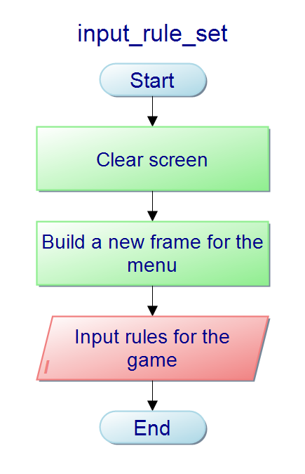
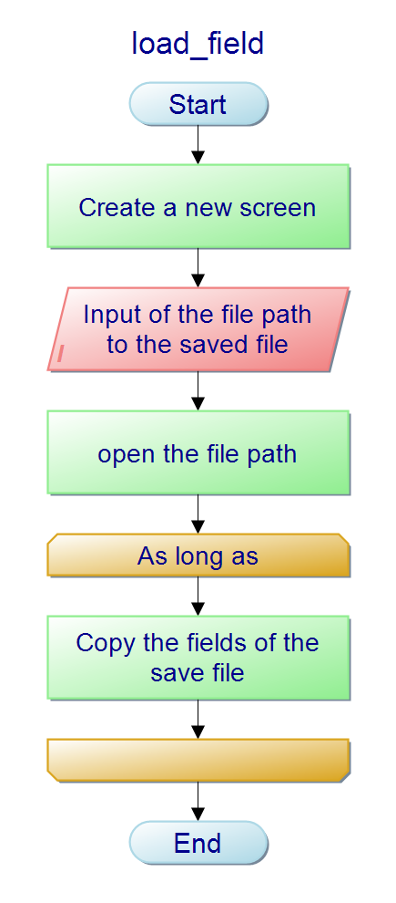

# Documentation <!-- omit in toc -->

- [Functions](#functions)
  - [`void` calculate_next_step](#void-calculate_next_step)
  - [`void` copy_field](#void-copy_field)
  - [`void` create_field](#void-create_field)
  - [`int` has_won](#int-has_won)
  - [`struct` input_rule_set](#struct-input_rule_set)
  - [`void` load_field](#void-load_field)
  - [`void` print_field](#void-print_field)
  - [`void` save_field](#void-save_field)
  - [`void` start_game](#void-start_game)
  - [`struct` start_menu](#struct-start_menu)
  - [`int` validate_input](#int-validate_input)
- [Structs](#structs)
  - [`struct` options](#struct-options)
  - [`struct` rule_set](#struct-rule_set)

## Functions

### `void` calculate_next_step

Calculate the next iteration based on the current field and rule set

|Parameter|Type|Description|
|---|---|---|
|current_options|`struct` options|Current game options|
|field|`int` Two-dimensional Array|Field to calculate next step from|
|next_field|`int` Two-dimensional Array|Field to "return" the next iteration to|


### `void` copy_field

Copy field from source_field to target_field

|Parameter|Type|Description|
|---|---|---|
|current_options|`struct` options|Current game options|
|source_field|`int` Two-dimensional Array|Source field to copy to the target|
|target_field|`int` Two-dimensional Array|Field to copy the source field to|


### `void` create_field

Creates an empty play field initialized with random cells

|Parameter|Type|Description|
|---|---|---|
|current_options|`struct` options|Current game options|
|field|`int` Two-dimensional Array|Field to fill with random values|


### `int` has_won

Compares current state with the comparable state to determine if the game is "won"

|Parameter|Type|Description|
|---|---|---|
|current_options|`struct` options|Current game options|
|current_state|`int` Two-dimensional Array|Current state of the game|
|compare_state|`int` Two-dimensional Array|State to be compared with the current state|

|Returns|Description|
|---|---|
|0, *false*|One filed has a difference|
|1, *true*|Both field are the same|

**DISCLAIMER:** C has no bool type, so this is just a work-around.


### `struct` input_rule_set

Generate rule set from user input



### `void` load_field

Loads a .gol file into the game, with your currently set options

|Parameter|Type|Description|
|---|---|---|
|current_options|`struct` options|Current game options|
|field|`int` Two-dimensional Array|Filed to be imported from a .gol file|



### `void` print_field

Outputs a field of cells to console

|Parameter|Type|Description|
|---|---|---|
|current_options|`struct` options|Current game options|
|field|`int` Two-dimensional Array|Filed to be printet into the console|
|iteration|`int`|Iteration to be displayed in the header|


### `void` save_field

Exports the current field to a .gol file.
This is basically a text file, so you can easily create your own save state

|Parameter|Type|Description|
|---|---|---|
|current_options|`struct` options|Current game options|
|field|`int` Two-dimensional Array|Filed to be exported into a .gol file|


### `void` start_game

This start the game of life; May the games begin!


### `struct` start_menu

Creates a simple framed start menu for the player to setup his options.


### `int` validate_input

Checks if the Input is valid

|Parameter|Type|Description|
|---|---|---|
|current_options|`struct` options|Current game options to be validated|

|Returns|Description|
|---|---|
|0|Options are valid|
|1|Options are invalid|

**DISCLAIMER:** C has no bool type, so this is just a work-around.


## Structs

### `struct` options

```c
struct options
{
    int height;
    int width;
    char alive;
    char dead;
    int iterations_per_second;
    char mode;
    struct rule_set game_rules;
};
```

### `struct` rule_set

```c
struct rule_set
{
    int min_revive;
    int max_revive;
    int min_survive;
    int max_survive;
};
```
